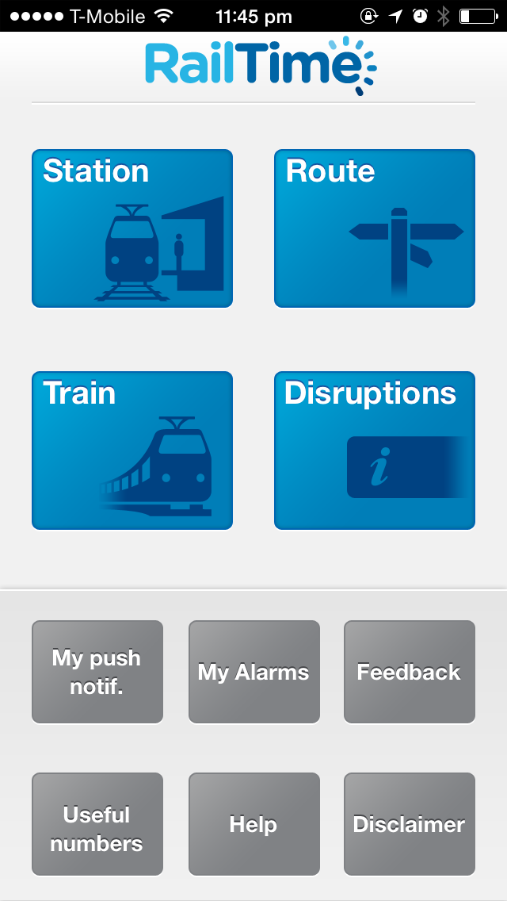
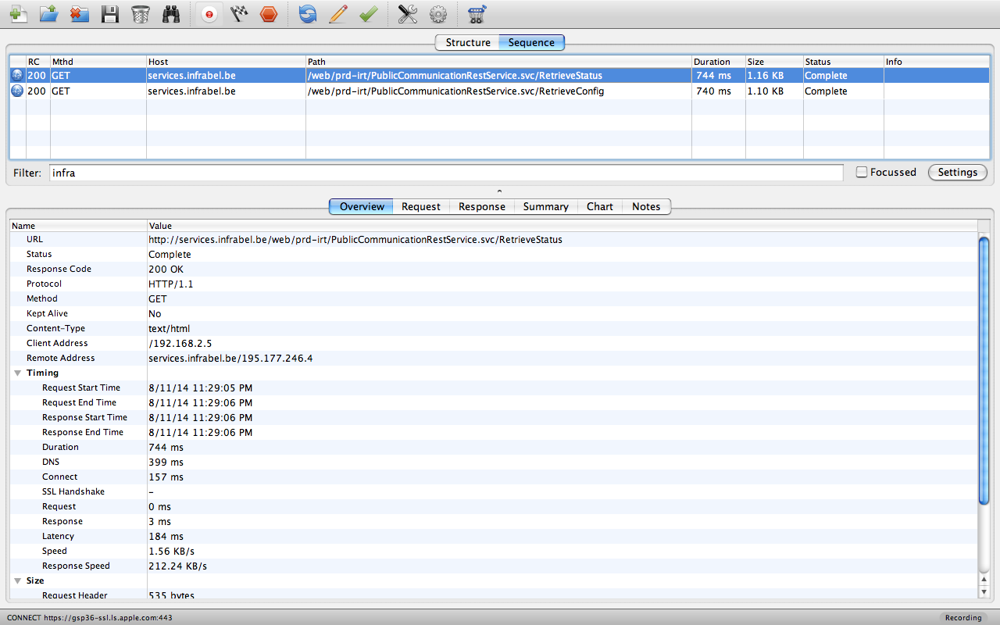
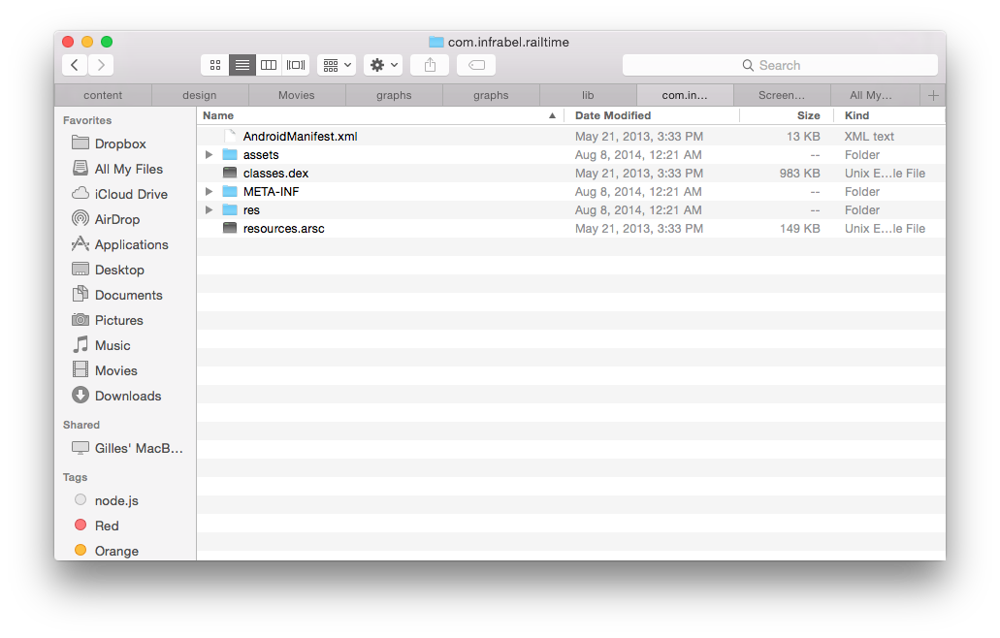
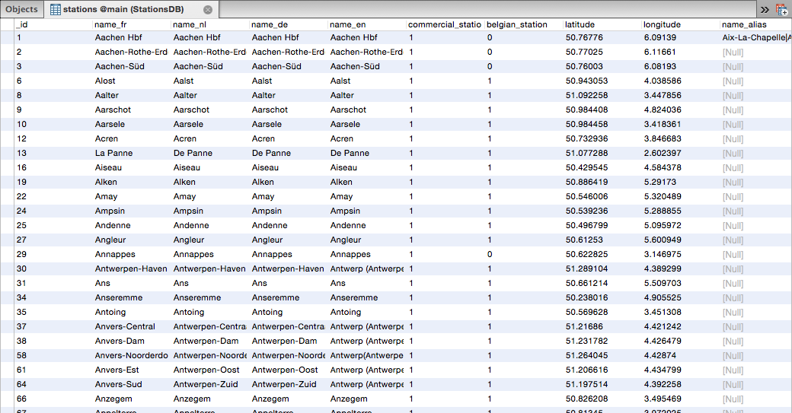
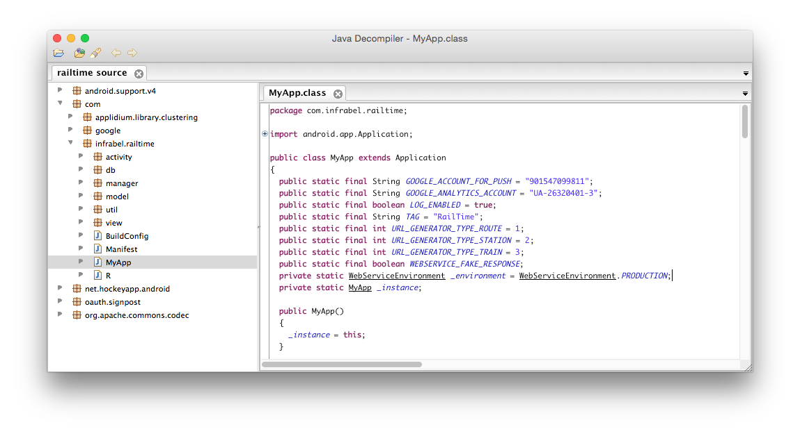

Here's a story on how we reverse-engineered the RailTime API over the weekend.

This document is intended to be used for educational purposes so take a seat, a sip of coffee and you might learn a thing or two.

On a secondary note, this article assumes that you have at least some knowledge on computer science.

As a final note, API design is not something you should take lightly. In this document you'll probably notice that I will point out quite a few things that are considered "bad practice", but that's ok because we can learn from them.


## Reverse-Engineering APIs

### 1. Capture
The first thing you will want to do when reverse-engineering is capture data.

### 2. Analyze
After you've captured enough data to work with, you can start analyzing and documenting.
Below are a few guidelines to get you started.

1. You'll first want to look for the API endpoint. The endpoint is the URL to which we will be sending the requests.
2. If the API is secured, figure out the authentication used to communicate.
3. Figure out the protocol used in the communication. (JSON/XML/SOAP)
4. Document all the possible API requests.

### 3. Build
Build cool stuff with it.
And don't forget to have fun!


# Railtime

## 1. Capture
Pretty much every mobile app nowadays uses some sort of an API to communicate. Their data has to come from somewhere, right?

Usually APIs communicate over HTTP, making it pretty straightforward to capture that data using an HTTP Proxy.

### HTTP Proxy

My goto app for that is [Charles](http://www.charlesproxy.com/), a cross-platform HTTP proxy that allows you to intercept all HTTP traffic coming in and going out.

This app does not only allow you to view your traffic but manipulate it as well, making it easier to modify the response and see how to application reacts which aids in analyzing the data.


## 2. Analyze
This is the most tricky part, but don't worry we'll figure it out.

1. First, let's look for the API endpoint.

I'm going to open up RailTime, an app that provides travel information for Belgian Rail (NMBS), a company owned by the Belgian government.



The only thing I did was open the app. Now let's look at the data that we received in Charles.



A few observations when the app starts:

- It checks the current status of the API (health check)
- It grabs the latest configuration
- It checks for updates to the Stations database (not shown here)

From this request we can clearly see the endpoint used for the API:

```http
http://services.infrabel.be/web/prd-irt/PublicCommunicationRestService.svc
```

This is telling us a few things.

1. They use Windows Communication Foundation for the API
2. They don't actually know how to develop a proper RESTful API, but we'll get to that later

So, let's dig into the request and see what my device is trying to send to the RailTime servers.

The first request was requesting the API status, a health check of sorts to see if everything is working as it should be and to disable functionality of the app in case of server maintenance.

```http
GET /web/prd-irt/PublicCommunicationRestService.svc/RetrieveStatus
```

And we can clearly see from the response that their web services are up and running. It even passes the server time, which can be useful too.

```json
{
	"Mobile": {
		"ApplicationEnabled": true,
		"InfoBarEnabled": true,
		"RouteSearchEnabled": true,
		"StationSearchEnabled": true,
		"TrainSearchEnabled": true
	},
	"RealTimeDataAvailable": true,
	"ServerTime": "\/Date(1407905854080+0200)\/",
	"Website": {
		"ApplicationEnabled": true,
		"InfoBarEnabled": true,
		"RouteSearchEnabled": true,
		"StationSearchEnabled": true,
		"TrainSearchEnabled": true
	}
}
```

Usually these APIs are open and don't require any kind of authentication to be able to use them. RailTime however secured their API, which is nice.

Luckily I know a thing or two about security.

### Security is key

Upon inspecting the request headers we can clearly see that they use OAuth 1.0

```hljs nohighlight
OAuth oauth_consumer_key="IPhone", oauth_nonce="97E5B889-E4BC-4973-B2BC-944E154CA2E3", oauth_signature="PjUdYBkMC0nmC%2F9yhrPIuV7COUg%3D", oauth_signature_method="HMAC-SHA1", oauth_timestamp="1407905853", oauth_version="1.0"
```

Unfortunately for us, OAuth can be tricky. Unfortunately for them, I don't give up that easily.

If you don't send the correct Authorization header you'll receive an **HTTP 401 UNAUTHORIZED** message from the API and there's nothing you can do about that thus preventing you from making any requests to their API.

If you inspect the OAuth header carefully, you can figure out a lot of variables that are required to sign your own OAuth requests, essentially replicating their authentication and granting you access to their API.

- The OAuth version used is 1.0, an older version of the spec but still secure
- The signature method used is HMAC-SHA1
- Their (public) consumer key is "IPhone"

Ignore the oauth_nonce for now, it's just a UUID v4.

Furthermore, they might be using [.Net Open Auth](http://dotnetopenauth.net/), but it doesn't matter which library they use so long as they implement the OAuth specification correctly.


#### But wait, so they can make requests to the API and I cannot? How does that work?

OAuth requires the signature (oauth_signature from the Authorization header) to be correct. So all we have to do is generate the correct signature for every request.

I won't go into the details on how to sign an OAuth request, but if you're interested you can read up on it here: http://tools.ietf.org/html/rfc5849#section-3.4.2.

You read all that? Good, because now we know that all that's missing to create the signature is the **private key**.

Private keys are usually baked into a mobile application, so that would be the best place to look.

Initially I looked around at reverse-engineering iOS applications, but they proved too difficult (not impossible) to reverse-engineer.

Luckily, the RailTime app is also available for Android. Aha!

Good thing I have some experience in reverse-engineering Java so I know that it's fairly easy and straight-forward to do.

If you're an Android developer, you might want to watch and learn how insecure Android apps can be.

#### Reverse-engineering the Android app

For those of you who want to get ahead and have some fun reverse-engineering Android apps, here's a deck from RSA Conference 2014 by our good friends viaForensics.

http://www.rsaconference.com/writable/presentations/file_upload/stu-w02b-beginners-guide-to-reverse-engineering-android-apps.pdf

As a bonus I'll mention that they built [Santoku](https://santoku-linux.com/), a linux bistro built for mobile forensics, malware analysis, and mobile app security testing. It's worth a look.

---

An apk (Android app) is nothing more than an archive, so we can simply extract its contents using our favorite unarchiver and you'll end up with the extracted (albeit compiled) app.



Oh shoot! That's it?

Not yet, all we can see now are assets used in the UI and some configuration files. Nothing fancy just yet.

We did however get the SQLite database for the train stations, which will be useful if you want to get a list of all the supported train stations for the API.

Upon opening the SQLite database we can see all the supported train stations for the app.



For some reason they are all commercial stations and the app doesn't show non-Belgian train stations so this leads me to believe that this database is just a subset of a much larger (European?) database of train stations.

---

The most important file in this APK is the `classes.dex` file, which is the bytecode generated by Google's Dalvik compiler.

Knowing that, we can simply convert the Dalvik bytecode back to Java bytecode (JAR). It's still compiled code, but by doing so we can use any existing Java decompiler to decompile the Java bytecode back to human readable source code.

Some metadata could potentially be lost in the translation from DEX > JAR but that's acceptable, I'm not interested in recompiling.

To convert the DEX > JAR, we can use the appropriately named [dex2jar](https://code.google.com/p/dex2jar/) utility for that.

```bash
d2j-dex2jar.sh /Users/michiel/Documents/apks/com.infrabel.railtime/classes.dex
```

That should do the trick, now we have a familiar looking JAR file.

Now all we have to do is decompile it using a Java decompiler such as [JD-GUI](http://jd.benow.ca/).

And that's it, we can now read the source code of the Android app.



After reading through the source code a bit, I found the secret key needed to create the OAuth signature and replicate their API requests.

Then all I had to do was sign my requests with the generated signature using the public key and the extracted private key.

We even wrote a [Go library](https://github.com/gillesdemey/go-oauth) to sign SHA-HMAC OAuth requests. You know, just because we can.

### Don't assume your code is safe
Because it never is. Truthfully, I didn't think that it would be that easy to decompile Dalvik bytecode back to the original source code.

They could have improved their security by [obfuscating](http://en.wikipedia.org/wiki/Obfuscation_(software\)) their source code, but even that would just have made it harder to read the source code, but not impossible.

There are a few other ways to secure your application, but I won't go into them here. If you'd like to know more, go and consult your nearest security expert.

I mean that, leave security to the experts.


## 3. Have fun
Reverse-Engineering can teach you a lot, but it should be done responsibly.

I for one learned a great deal about OAuth1 message signing and decompiling Dalvik bytecode to it's original source code.

There are also a few thoughts that I'd like to share.


## Some thoughts on the RailTime API

The RailTime API is one of the few APIs that I found that are actually secured, which is a good thing. They are doing a good job at keeping those pesky script kiddies out.

On the other hand, there are quite a few bad practices that can be learned from this API.

### 1. They don't use RESTful resource URLs
As I mentioned earlier, their API endpoint is named `PublicCommunicationRestService.svc` implying that the API is actually RESTful.

While in truth it's not.

In reality they have awkwardly named URLs that look like function definitions.

```hljs nohighlight
/PublicCommunicationRestService.svc/RetrieveStationSchedule
/PublicCommunicationRestService.svc/RetrieveTrainSchedule
/PublicCommunicationRestService.svc/RetrieveInfoMessagesForSmartPhone
```

Especially that last one make me laugh.

Naming is very important.
As Phil Karlton once put it:

> "There are only two hard problems in Computer Science:
>   cache invalidation and naming things."

If you want to know how to do it properly, I highly recommend [Apigee's deck about API design](https://www.slideshare.net/apigee/api-design-3rd-edition).

### 2. They respond with the wrong Content-Type
Their API responds with the `Content-Type: text/html` while in truth they are sending JSON. so the correct header should be `Content-Type: application/json`.

Always send the correct `Content-Type` header so that the receiving application knows what to do with it. Especially if your API supports multiple data formats (JSON, XML).

This will also help greatly when using front-end frameworks (e.g. AngularJS)
because they will automatically call `JSON.parse()` when the content-type is set to `application/json`.

### 3. The character set is not explicitly set
According to the W3C, it is advised to always declare the charset explicitly so that the browser (or any other interpreter) knows the character encoding for the data that's sent.
http://www.w3.org/International/O-HTTP-charset

By default, if the charset is not specified, it will default to the charset preferred by the user's browser/operating system.

In my case, I'm writing this on a Macbook where my locale settings are all set to American standards.

So not specifying the charset will result in my browser decoding the JSON as such:

`"name": "Chênée"`

To fix this, you simply specify the charset along with your Content-Type header:

```hljs nohighlight
Content-Type: application/json; charset=utf-8
```

Now it will properly decode the JSON:

`"name": "Chênée"`

W3C recommends that you use utf-8 for all content, but any IANA registered character set is allowed. This however does not mean that every browser will understand your character set.

### 4. They have awkward non-standard date values
It's not so much their fault, but rather that of the .NET framework.
That's what you get for just serializing your objects to JSON.

Here's what a .Net JSON serialized date looks like:

```json
{
	"ServerTime": "\/Date(1407905854080+0200)\/"
}
```

[Which is a nightmare](http://www.hanselman.com/blog/OnTheNightmareThatIsJSONDatesPlusJSONNETAndASPNETWebAPI.aspx)

As quoted from the article

> Yuck. Regardless, it doesn't bind with KnockoutJS either.

Which is kind of a big deal. If you're building a web application and you're working with dates, you want your framework to understand the date and not treat it as a string or anything else.

So what's the proper way of doing this?

Let me tell you that dates are not that easy to work with, but there are a few standards floating around the internet.

One of them is the [Unix timestamp](http://en.wikipedia.org/wiki/Unix_time), which is defined as the number of seconds that have elapsed since UTC Thursday, 1 January 1970.

The Unix timestamp is one of the more popular ones, I've seen them being used by the Instagram API, Twitter API and SoundCloud API.

A Unix timestamp date will look like this:

```json
{
	"ServerTime": "1406204196"
}
```

The typical length for a Unix timestamp is 10 digits, although sometimes represented as 13 digits. JavaScript Dates will use the 13 digits.

The 13 digits include the milliseconds as well, rather than just the seconds.

Another (W3C endorsed) standard floating around is ISO 8601 and is used by Facebook. And it's the format used when calling `(new Date()).toJSON()` in JavaScript.

```json
{
	"serverTime": "2015-02-15T01:25:14.212Z"
}
```

A good library to deal with Dates is [Moment.js](http://momentjs.com/). I highly recommend it if you want to normalize dates.

### 5. They pass the language as a url parameter

```hljs nohighlight
/RetrieveInfoMessagesForSmartPhone?language=3
```

This is not done, people. We've figured this out back in 1996. ([HTTP 1.0](http://tools.ietf.org/html/rfc1945))

If you want to pass the preferred (natural) language, you should pass it in the `Accept-Language` header for every request.

Passing it as a url parameter and giving it a value of '3' is just absurd and meaningless.

By the way, they have defined the languages as such.

<table>
  <thead>
    <tr>
      <th>id</th>
      <th>Language</th>
    </tr>
  </thead>
  <tbody>
    <tr>
      <td>0</td>
      <td>French</td>
    </tr>
    <tr>
      <td>1</td>
      <td>Dutch</td>
    </tr>
    <tr>
      <td>2</td>
      <td>German</td>
    </tr>
    <tr>
      <td>3</td>
      <td>English</td>
    </tr>
  </tbody>
</table>

### Bottomline

Think before you create.

To me, the RailTime API just looks awkward, as if it's not even a proper API but rather something they added to their existing code base later on because it had to work on smartphones now.

API design is not that straight-forward and yes, some thinking and engineering is required. You'll probably go over several iterations of your API, but that's ok. API versioning is nothing new.

One last thing you should remember from all this is to adopt open standards. Don't be that guy that uses SOAP to communicate. (I'm looking at you, "De Lijn") I can't image the hell they had to go through.

Even [the White House has good standards](https://github.com/WhiteHouse/api-standards).
